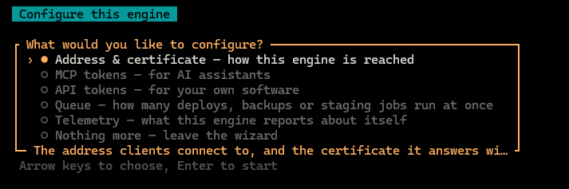

# Configure the engine

`pae configure` on your VPS walks through the engine's own settings: the address assistants use, what those assistants are allowed to do, tokens for your own software, how many jobs run at once, the Docker Hub login image downloads go out under, which base images are kept ready, the memory the site database keeps for caches, the firewall's web interface, and what the engine reports about itself. You pick one area, change it, and come back for the next.

```bash
pae configure
```

What you should see: a menu. The arrow keys move, Enter opens the line you are on. The line under the box says what that choice changes.



When you leave, the wizard prints what it wrote. If you changed nothing, it says so.

## What each choice does

- **Address and certificate.** The address an assistant is told to connect to, including `https://` and the port, and the certificate on that name. The certificate has to cover the name in the address, or the assistant refuses the connection. Asking for a certificate takes the engine's own address down for a moment.
- **MCP tokens.** Connect an assistant, decide which commands every assistant is offered, or give one assistant fewer of those. A token can only receive commands the engine is offering to everyone.
- **API tokens.** A token for software you run yourself, not for an assistant. You can limit which parts of the engine that token may call, or revoke it.
- **Queue.** How many deploys, backups, or staging copies run at the same time. They share one queue. The wizard asks for a number from 1 to 32 and applies it.
- **Docker Hub.** The Docker Hub account every image download on this server goes out under. Without one, all projects share one anonymous limit for your server's address, and busy servers hit it: deploys then fail with "Docker Hub temporarily refused further downloads". Use a Docker Hub access token with the **Public Repo Read-only** scope. The wizard checks the token with Docker Hub, and warns you if it can read private repositories, because every project on this server could then download them.
- **Prewarmed images.** Which base images the server keeps ready before any project asks for them, and how much disk that may use. By default it keeps none. The first deploy that needs an image builds or downloads it, later deploys reuse it, and the server deletes it again after a few days without use. Pick the images your projects use when you want their first deploy to skip that wait: a PHP version costs about 1 GB and several minutes to build. The **budget** is the most disk one prewarm run may spend (6G by default, `none` for no limit), and the **reserve** is the free disk it always leaves (10G by default). Changes apply at the next weekly prewarm, or straight away with `pae system:image:prewarm`.
- **Site database.** How much memory the database for hosted PHP sites keeps for its caches: the InnoDB buffer pool (32M by default), the MyISAM key buffer (8M) and the Aria page cache (8M). Raise them when hosted sites have large databases. A size is written like `64M` or `1G`. Saving one restarts that database, so sites lose it for a few seconds; the wizard asks first.
- **Telemetry.** Whether reports leave this server, how much a report carries, and whether bug reports are allowed. Recording a deploy on the server itself carries on either way: [Telemetry](what-is-collected.md).

**Nothing more** closes the menu.

To open one area without the menu, name it:

```bash
pae configure mcp-tokens
```

The names are `address`, `mcp-tokens`, `api-tokens`, `queue`, `docker-hub`, `prewarm`, `sites-db`, and `telemetry`. Add `--dry-run` to see what would be written and write nothing.

The wizard needs the terminal you have over SSH. It will not run from a script.

## Offer the assistant fewer commands

A new install offers every command. Untick the ones you do not use and the assistant is offered a shorter list.

```bash
pae configure mcp-tokens
```

Choose **Global scope**. **Groups** ticks whole areas on and off. **Commands** lists one area and lets you untick single commands. **Ceiling** is how far a ticked command may go: look only, change but not delete, or everything including deletion. The hint under the menu counts how many commands would be offered.

Nothing there is written until you pick **Review and save** and say yes. An assistant that is already connected keeps the list it was given when it connected. Reconnect it to see the change.

To give one assistant less than the others, choose **Tokens** on the same menu, pick that assistant, and untick. This can only take commands away. It cannot offer a command you turned off for everyone. `pae mcp:token:list` shows the result in its **Commands** column.

The same limits, written out as settings: [Decide what the assistant may do](../04-connecting-your-ai/your-assistant.md#decide-what-the-assistant-may-do).

## Troubleshooting

**It says the wizard needs a terminal.**
Run `pae configure` in the SSH session on the VPS. A script cannot answer the menu.

**I saved new limits and the assistant still does the old things.**
Reconnect it. It keeps the command list from when it connected.

**I asked for a certificate and could not reach the engine for a moment.**
That is the request. The engine's own address on port 2011 stops briefly while the certificate is fetched, then comes back.

## From the server

The same areas as single commands: [CLI commands](../06-commands/pae-cli.md#configuring-the-engine).
